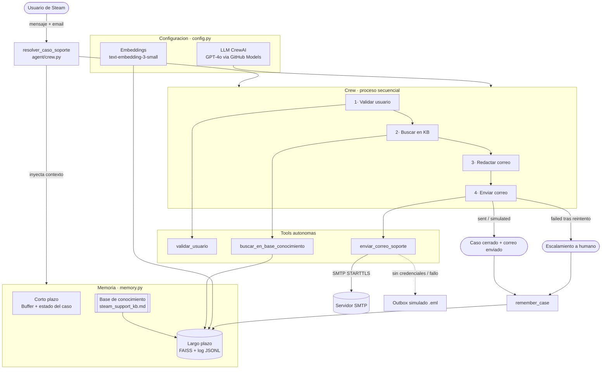

# Steam Support Agent — Módulo de Agente Autónomo

Propuesta de sección para el `README.md` del proyecto **Steam-Support-Bot**.
Documenta el agente autónomo capaz de **enviar correos de soporte de forma
autónoma** (confirmación de tickets, alertas de seguridad y recuperación de
cuentas de Steam), integrado de forma limpia sobre el flujo existente
(LangChain + GitHub Models / GPT-4o).

---

## 1. ¿Qué hace?

El agente recibe el mensaje de un usuario de Steam y, **por decisión propia**,
ejecuta el siguiente plan jerárquico priorizado:

1. **Valida** la identidad/datos del usuario y genera un ticket con prioridad.
2. **Busca** el procedimiento oficial en la base de conocimiento (RAG / FAISS).
3. **Redacta** un correo claro, empático y accionable.
4. **Envía** el correo al usuario y **reacciona** al resultado (reintento o
   escalamiento humano si el envío falla).

---

## 2. Estructura del módulo (archivos limpios)

```
agent/
├── __init__.py
├── config.py                 # LLM (GPT-4o vía GitHub Models), embeddings, rutas, .env
├── memory.py                 # Memoria corto plazo (buffer) + largo plazo (FAISS)
├── agents.py                 # Agentes CrewAI (Analista de Soporte, Comunicaciones)
├── tasks.py                  # Plan jerárquico de 4 tareas encadenadas
├── crew.py                   # Orquestación + entrypoint resolver_caso_soporte()
├── main.py                   # CLI de ejecución
├── requirements-agent.txt    # Dependencias del agente
├── diagrams/
│   └── orchestration.mermaid # Diagrama de orquestación (IE8)
├── data/
│   ├── steam_support_kb.md   # Base de conocimiento (memoria largo plazo)
│   ├── faiss_index/          # Índice vectorial persistido (autogenerado)
│   └── email_outbox/         # Correos en modo simulado (.eml, autogenerado)
└── tools/
    ├── email_tool.py         # enviar_correo_soporte (SMTP + fallback simulado)
    ├── knowledge_tool.py     # buscar_en_base_conocimiento (FAISS)
    └── validation_tool.py    # validar_usuario (datos + ticket + prioridad)

tests/
└── test_agent_flows.py       # Pruebas de decisión adaptativa (IE6)
```

---

## 3. Instrucciones de ejecución

### 3.1. Requisitos previos
Sigue primero el setup del `README.md` raíz (entorno virtual + `.env` con
`GITHUB_TOKEN`). Luego instala las dependencias del agente:

```bash
# con el entorno virtual activo
pip install -r agent/requirements-agent.txt
```

### 3.2. Variables de entorno
El agente reutiliza las mismas llaves del proyecto y añade (opcionalmente) SMTP
para el envío **real** de correos. Añade al `.env`:

```ini
# --- Ya existentes (GitHub Models) ---
GITHUB_TOKEN="..."
GITHUB_BASE_URL="https://models.inference.ai.azure.com"

# --- Envío de correo (OPCIONAL) ---
# Si se omiten, el agente funciona en MODO SIMULADO (guarda los .eml en data/email_outbox/)
SMTP_HOST="smtp.gmail.com"
SMTP_PORT="587"
SMTP_USER="tu_correo@gmail.com"
SMTP_PASSWORD="tu_app_password_de_16_digitos"   # App Password de Gmail, NO la contraseña normal
SMTP_FROM="tu_correo@gmail.com"
```

> **Gmail:** genera un *App Password* en tu cuenta Google (requiere 2FA activo).
> Sin SMTP el agente igualmente completa el flujo y guarda el correo como `.eml`.

### 3.3. Ejecutar el agente

```bash
# Caso demo precargado (cuenta posiblemente comprometida)
python -m agent.main

# Caso personalizado
python -m agent.main \
  --email usuario@ejemplo.com \
  --mensaje "No puedo iniciar sesion y vi cargos que no reconozco" \
  --steam-id miUsuario
```

### 3.4. Ejecutar las pruebas de decisión adaptativa (sin red ni credenciales)

```bash
python -m tests.test_agent_flows      # imprime PASS/FAIL por escenario
# o
pytest tests/test_agent_flows.py -v
```

---

## 4. Justificación técnica

### 4.1. ¿Por qué CrewAI?
- **Orquestación basada en roles**: modela el soporte como una organización
  (Analista + Comunicaciones), lo que hace explícita y legible la división de
  responsabilidades y la planificación.
- **Tools de primera clase**: cada herramienta declara su `args_schema`
  (Pydantic); el LLM decide cuándo invocarlas a partir del contexto, que es
  justo el comportamiento autónomo que exige el envío de correos.
- **Compatibilidad**: CrewAI usa LiteLLM, por lo que apunta al endpoint
  OpenAI-compatible de **GitHub Models** sin cambiar el backend del proyecto.
- **Escalabilidad**: añadir nuevos roles (p. ej. un agente de reembolsos) o
  nuevas tools es incremental y no rompe la arquitectura.

### 4.2. ¿Por qué FAISS para la memoria semántica?
Es un Vector Store **local, en archivo y sin servicios externos**, ideal para
reproducibilidad en una evaluación: el índice se persiste en `data/faiss_index/`
y se recarga entre ejecuciones, dando **continuidad** (memoria de largo plazo)
sin depender de Docker ni de una base de datos gestionada.

### 4.3. Memoria de dos niveles
- **Corto plazo** (`ShortTermMemory`): buffer conversacional + estado vivo del
  caso (ticket, prioridad, datos validados). Garantiza coherencia dentro de la
  sesión.
- **Largo plazo** (`LongTermMemory`): FAISS + log JSONL. Indexa la base de
  conocimiento y los resúmenes de casos resueltos, y los recupera por similitud
  semántica para fundamentar respuestas y dar continuidad entre sesiones.

### 4.4. Diseño de la tool de correo (robustez y autonomía)
`enviar_correo_soporte` envía por SMTP con **STARTTLS y reintentos**; si no hay
credenciales o el envío falla, **no rompe el flujo**: guarda el correo como
`.eml` (modo simulado) y devuelve un `status` (`sent`/`simulated`/`failed`) que
el agente usa para **decidir** si cierra el caso o lo escala a un humano.

---

## 5. Diagrama de Orquestación de Componentes



---

## 6. Mapa de Indicadores de Evaluación (IE)

| IE  | Requerimiento | Dónde se cumple |
|-----|---------------|-----------------|
| IE1 | Framework de agentes | CrewAI en `agents.py` / `crew.py` |
| IE2 | Tool autónoma de correo | `tools/email_tool.py` (`enviar_correo_soporte`) |
| IE3 | Memoria corto plazo | `memory.py` (`ShortTermMemory`) |
| IE4 | Recuperación semántica / Vector Store | `memory.py` (`LongTermMemory` + FAISS), `knowledge_tool.py` |
| IE5 | Planificación jerárquica | `tasks.py` (4 tareas encadenadas por prioridad) |
| IE6 | Decisiones adaptativas | `tests/test_agent_flows.py` + lógica en tools |
| IE7 | Código modular | Paquete `agent/` |
| IE8 | Diagrama Mermaid | `diagrams/orchestration.mermaid` + sección 5 |
| IE9/IE10 | Informe técnico | `docs/Informe_Tecnico_EP2.md` |
